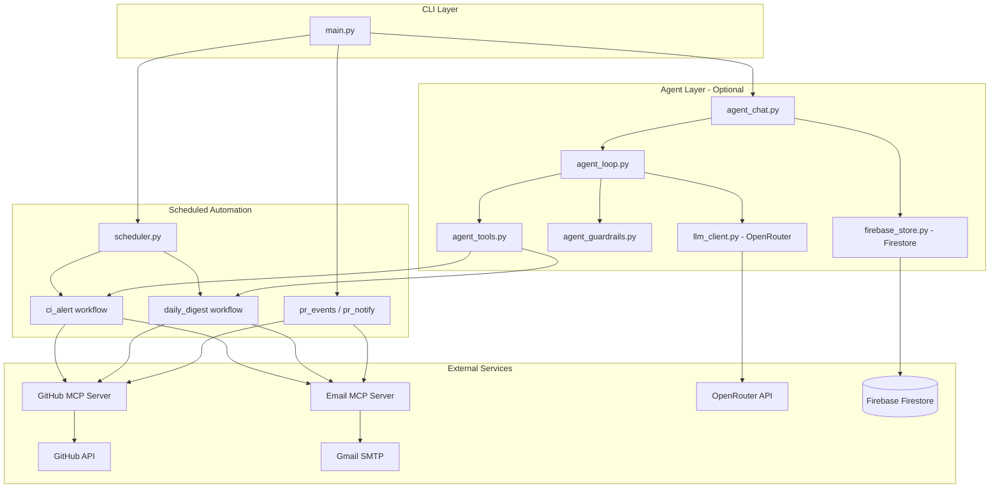

# Architecture

## System overview

## Design principles (industry-standard patterns)

| Pattern | Where | Why |
|---------|--------|-----|
| **Separation of config vs secrets** | `config.yaml` + `.env` | Non-secret settings in YAML; tokens/passwords in env (12-factor app) |
| **Workflow modules** | `src/workflows/` | Each automation (CI alert, digest, PR) is isolated and testable |
| **MCP as integration boundary** | `mcp_manager.py` | GitHub and email access go through official MCP servers, not ad-hoc scraping |
| **Dry-run everywhere** | `--dry-run` on workflows | Safe preview before sending emails |
| **Idempotency / dedup** | `logs/state.json`, `workflow_state.py` | Prevents duplicate CI alerts and PR notifications |
| **Structured logging** | `logs/app.log` via `app_logging.py` | Machine-readable logs for debugging and audit |
| **Agent tool layer** | `agent_tools.py` | LLM calls existing workflows — no duplicate business logic |
| **Human-in-the-loop** | `agent_guardrails.py` | Confirmation before sensitive actions (emails, alerts) |
| **Durable agent memory** | Firestore | Chat history and run audit survive CLI restarts |
| **Observability** | `agent_runs`, `workflow_history`, `agent-history` CLI | Token usage, latency, tool calls logged for audit |
| **CI on all branches** | `.github/workflows/ci.yml` | Unit tests on every push; integration tests when secrets are set |

## Data flow: `ask` command

1. User runs `python src/main.py ask "..."`.
2. `agent_chat.py` loads prior messages from Firestore (`agent_sessions/{id}/messages`).
3. `agent_loop.py` sends conversation + tool schemas to OpenRouter.
4. Model may return tool calls → `agent_tools.py` runs wrapped workflows (e.g. `fetch_github_summary`).
5. Sensitive tools pause for `Proceed? [y/N]` unless `--yes`.
6. Final answer saved to Firestore; run metadata logged to `agent_runs`.

## Data flow: scheduler

1. User runs `python src/main.py run-scheduler` (foreground process).
2. APScheduler triggers:
   - **Daily digest** at `schedule.digest_time`
   - **CI alert check** every `schedule.ci_check_interval_minutes`
3. No LLM or Firebase required — uses MCP workflows only.

## Local vs cloud

| Component | Runs where |
|-----------|------------|
| Python app, MCP servers, scheduler | Your machine (local) |
| GitHub data | GitHub API via MCP |
| Email | Gmail via Email MCP |
| Agent LLM | OpenRouter (cloud API) |
| Agent memory | Firebase Firestore (cloud) |

No AWS or custom server hosting is required for the core product.
